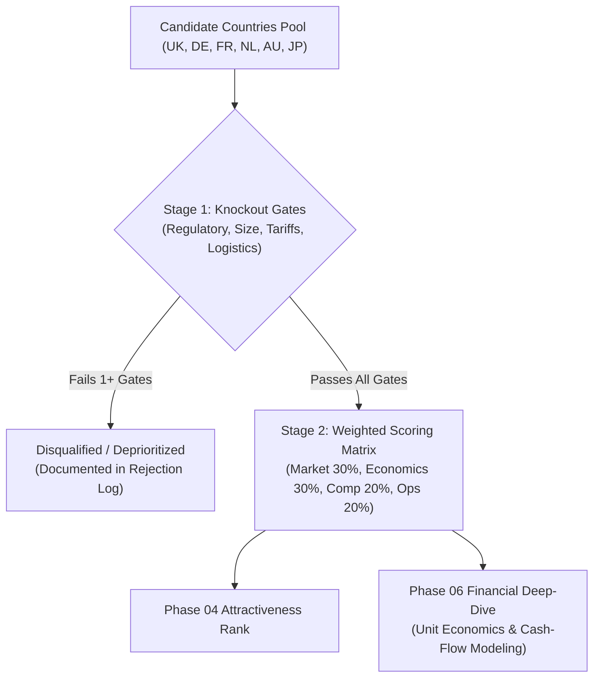

# NovaHome International Expansion: Decision Criteria & Hurdle Framework

**Document ID:** `NH-STRAT-2026-004`  
**Framework:** Multi-Criteria Decision Analysis (MCDA) & Investment Hurdle Rates  
**Author:** Nilesh Kanti (Senior Consulting Analyst)  

---

## 1. Objective & Decision Architecture

To eliminate subjective bias and ensure capital is allocated with fiduciary discipline, NovaHome evaluates international markets through a two-stage filter:

1. **Stage 1: Knockout Gates ("Red Lines")**: Binary pass/fail conditions. If a country violates any single knockout rule, it is **disqualified immediately**, regardless of market size or brand appeal.
2. **Stage 2: Weighted Attractiveness & Feasibility Scoring**: Surviving candidate countries are ranked across a quantitative multi-factor matrix spanning four key dimensions.

---

## 2. Stage 1: Knockout Gates (Binary Disqualification Rules)

A market is disqualified if it triggers any of the following four red lines:

| Gate ID | Gate Dimension | Rule / Boundary | Consulting Rationale |
| :--- | :--- | :--- | :--- |
| **KO-1** | Addressable Market Floor | **Serviceable Addressable Market (SAM) < $50M** | The market lacks sufficient revenue runway to justify localized regulatory, inventory, and legal overhead. |
| **KO-2** | Punitive Trade Barriers | **Effective import tariff + customs penalty > 18%** | Excessive tariffs compress gross margins below the minimum sustainable contribution threshold. |
| **KO-3** | Heavy Logistics Vacuum | **No proven two-person 3PL network capable of handling 40kg+ home delivery** | Inability to deliver safely and cost-effectively leads to catastrophic damage rates, refunds, and brand destruction. |
| **KO-4** | Regulatory / Compliance Veto | **Prohibitive data localization or electrical re-engineering requirement (> $250k or > 9 months)** | Delays time-to-market beyond the FY2026 strategic window and exceeds software engineering budgets. |

---

## 3. Stage 2: Weighted Attractiveness & Feasibility Scoring Matrix

Surviving markets are scored on a scale of **1.0 (Worst)** to **5.0 (Best)** across four strategic pillars:

| Category | Weight (%) | Evaluated Criteria | Key Underlying Metrics |
| :--- | :--- | :--- | :--- |
| **1. Market Demand & Growth** | **30%** | Size of addressable prize and category momentum. | • SAM Size ($M USD) • 3-Year Market CAGR (%) • Target Demographics (Households $> \$65\text{k}$) |
| **2. Financial & Unit Economics** | **30%** | Profitability, margin resilience, and capital velocity. | • Hardware Contribution Margin (%) • Projected LTV/CAC Ratio • Payback Period (Months) |
| **3. Competitive Dynamics** | **20%** | Ease of capturing market share and lack of entrenchment. | • Market Concentration (CR4) • Whitespace in $600–$1,200 mid-tier • Incumbent ad spend pressure |
| **4. Operational Ease & Execution** | **20%** | Speed to deploy and regulatory/logistics friction. | • Logistics cost per unit delivered • Language localization complexity • Regulatory certification lead time |
| **Total** | **100%** | **Composite Attractiveness Index** | **Weighted Average Score (1.00 – 5.00)** |

---

## 4. Key Financial Hurdle Definitions & Formulas

Every quantitative metric utilized in our screening and financial models is governed by exact mathematical definitions:

### 1. Compound Annual Growth Rate (CAGR)
Measures the smoothed annualized growth rate of the target market over a specified investment horizon:
$$\text{CAGR}(t_0, t_n) = \left( \frac{\text{Value}_{t_n}}{\text{Value}_{t_0}} \right)^{\frac{1}{n}} - 1$$
* **NovaHome Hurdle**: $\ge 4.5\%$ per annum (2026–2029).

### 2. Delivered Hardware Contribution Margin ($M_c$)
Measures the net cash profit generated per physical unit sold after all variable production, shipping, and delivery costs:
$$M_c = \frac{\text{Net Revenue} - (\text{COGS} + \text{Ocean Freight} + \text{Tariffs} + \text{Domestic 3PL Delivery} + \text{Payment Fee})}{\text{Net Revenue}}$$
* **NovaHome Hurdle**: $\ge 28.0\%$ delivered contribution margin in Year 1.

### 3. Customer Acquisition Cost (CAC)
Total localized sales and marketing expenditure divided by the number of new customers acquired:
$$\text{CAC} = \frac{\sum \text{Paid Ad Spend} + \text{Agency Fees} + \text{Influencer Collabs}}{\text{Total New Units Sold}}$$
* **NovaHome Hurdle**: Initial in-country $\text{CAC} \le \$260$ in Year 1, improving to $\le \$220$ by Year 2.

### 4. Customer Lifetime Value (LTV)
The total net contribution margin expected from a customer over their relationship, including hardware and digital subscription:
$$\text{LTV} = \text{Hardware Contribution} + \sum_{t=1}^{T} \frac{\text{Monthly Subscription Fee} \times \text{Gross Margin}_{\text{sub}} \times (1 - \text{Churn Rate})^t}{(1 + r)^t}$$
* **NovaHome Hurdle**: $\text{LTV} / \text{CAC} \ge 3.0\times$ by Month 24.

### 5. Cash-Flow Payback Period
The time required for cumulative net operating cash flows from the expansion to equal the initial upfront capital outlay:
$$\text{Payback Period} = t \quad \text{where} \quad \sum_{i=1}^{t} \text{Operating Cash Flow}_i \ge \text{Initial Investment } I_0$$
* **NovaHome Hurdle**: $\le 18\text{ months}$ from commercial launch date.

### 6. Internal Rate of Return (IRR)
The discount rate that equates the Net Present Value (NPV) of all future project cash flows to zero:
$$0 = \sum_{t=0}^{N} \frac{\text{Cash Flow}_t}{(1 + \text{IRR})^t}$$
* **NovaHome Hurdle**: 3-Year Project $\text{IRR} \ge 15.0\%$.

---

## 5. Threshold Governance & Decision Rules

* **Priority Green Light**: Country clears all Stage 1 knockout gates, scores $\ge 3.75 / 5.00$ on the Weighted Scoring Matrix, and demonstrates a modeled payback $\le 18\text{ months}$.
* **Secondary / Phased Entry**: Country clears Stage 1 gates, scores between $3.20$ and $3.74$, but requires localization or retail distribution to de-risk.
* **Red Light / Disqualified**: Country fails any Stage 1 gate OR scores $< 3.20$ on the composite matrix.
