# NovaHome International Expansion: MECE Issue Tree

**Document ID:** `NH-STRAT-2026-002`  
**Framework:** Mutually Exclusive, Collectively Exhaustive (MECE) Problem Decomposition  
**Author:** Nilesh Kanti (Senior Consulting Analyst)  

---

## 1. Executive Summary & MECE Rationale

To determine whether, where, and how NovaHome should expand internationally, we disaggregate the central strategic question into **four mutually exclusive, collectively exhaustive branches**:

$$\text{Expansion Decision} = f(\text{Market Attractiveness}, \text{Competitive Feasibility}, \text{Financial Viability}, \text{Operational Capabilities})$$

* **Mutually Exclusive (ME)**: Each branch evaluates a non-overlapping domain:
  * *Market Attractiveness* isolates external macroeconomic and market demand size.
  * *Competitive Feasibility* assesses external rival dynamics and product-market fit.
  * *Financial Viability* models internal unit economics, margin structures, and returns.
  * *Operational Capabilities* examines execution feasibility, compliance, and supply chain.
* **Collectively Exhaustive (CE)**: A market cannot be approved if it fails any single branch (e.g., an attractive and profitable market that cannot legally or logistically be served is disqualified).

---

## 2. Mermaid Visual Issue Tree

```mermaid
flowchart TD
    ROOT["Should NovaHome expand into international markets in 2026, and if so, where and how?"]
    
    BRANCH1["1. Market Attractiveness\n(Is the external prize large enough?)"]
    BRANCH2["2. Competitive Advantage\n(Can NovaHome win market share?)"]
    BRANCH3["3. Financial Viability\n(Can we generate attractive, safe returns?)"]
    BRANCH4["4. Operational Feasibility\n(Can we execute and manage risks?)"]

    ROOT --> BRANCH1
    ROOT --> BRANCH2
    ROOT --> BRANCH3
    ROOT --> BRANCH4

    %% Branch 1 Sub-elements
    BRANCH1 --> B11["1.1 Market Size & Growth\n• TAM, SAM, SOM\n• Category 3-Year CAGR"]
    BRANCH1 --> B12["1.2 Macro & Demographic Fit\n• Target household disposable income\n• Home fitness adoption rate"]
    BRANCH1 --> B13["1.3 Digital Infrastructure\n• Broadband / 5G penetration\n• Digital subscription willingness"]

    %% Branch 2 Sub-elements
    BRANCH2 --> B21["2.1 Competitor Landscape\n• Incumbent market concentration (CR4)\n• Price tier whitespace ($600-$1,200)"]
    BRANCH2 --> B22["2.2 Value Proposition Fit\n• Consumer preference for compact gear\n• Willingness to pay for connected app"]
    BRANCH2 --> B23["2.3 Channel Access\n• D2C digital marketing efficiency\n• Retail partner willingness"]

    %% Branch 3 Sub-elements
    BRANCH3 --> B31["3.1 Unit Economics\n• Localized Hardware Gross Margin\n• Blended CAC and LTV/CAC ratio"]
    BRANCH3 --> B32["3.2 Capital & Break-Even\n• Cumulative Capex/Opex\n• Months to cash-flow break-even"]
    BRANCH3 --> B33["3.3 Investment Returns\n• 3-Year Project IRR (vs. 15% hurdle)\n• Payback period (<18 mo ceiling)"]

    %% Branch 4 Sub-elements
    BRANCH4 --> B41["4.1 Logistics & Delivery\n• 3PL bulky freight network availability\n• Reverse logistics & return processing"]
    BRANCH4 --> B42["4.2 Regulatory & Compliance\n• CE/UKCA safety & electrical certification\n• GDPR data privacy compliance"]
    BRANCH4 --> B43["4.3 Localization & Support\n• Language localization requirements\n• Local customer service SLAs"]
```

---

## 3. Detailed Branch Decomposition

### Branch 1: Market Attractiveness (External Market Opportunity)
* **1.1 Market Sizing & Momentum**
  * *1.1.1* What is the Total Addressable Market (TAM) for fitness equipment in the target country?
  * *1.1.2* What is the Serviceable Addressable Market (SAM) for mid-market connected equipment ($600–$1,500)?
  * *1.1.3* What is the Serviceable Obtainable Market (SOM) NovaHome can capture within 3 years?
  * *1.1.4* Is the market growing at or above our hurdle CAGR ($\ge$ 4.5%)?
* **1.2 Demographic & Socioeconomic Indicators**
  * *1.2.1* How many target households earn above the disposable income threshold ($\ge$ $65,000 USD equivalent)?
  * *1.2.2* What percentage of target demographic households reside in homes with adequate floor space ($>70\text{ m}^2$)?
* **1.3 Digital & Cultural Readiness**
  * *1.3.1* What is the household broadband and digital payment penetration rate?
  * *1.3.2* Are consumers culturally receptive to digital monthly fitness subscriptions?

---

### Branch 2: Competitive Advantage & Market Feasibility (Right to Win)
* **2.1 Competitive Intensity & Market Concentration**
  * *2.1.1* Who are the incumbent players across the budget, mid-market, and luxury tiers?
  * *2.1.2* What is the four-firm concentration ratio (CR4) in the target market?
  * *2.1.3* Does a clear "affordable premium" whitespace exist between $600 and $1,200?
* **2.2 Differentiation & Value Proposition**
  * *2.2.1* Does NovaHome’s compact/folding design solve local housing constraints better than Peloton or NordicTrack?
  * *2.2.2* Can NovaHome achieve brand trust without physical showroom retail presence?
* **2.3 Channel & Distribution Accessibility**
  * *2.3.1* Can NovaHome acquire customers digitally via paid search/social at a sustainable CAC?
  * *2.3.2* Are premium sporting goods retailers open to distribution or consignment partnerships?

---

### Branch 3: Financial Viability & Capital Efficiency (The Economic Model)
* **3.1 Unit Economics & Contribution Margins**
  * *3.1.1* What is the net delivered hardware margin after international ocean freight, import duties, and localized warehousing?
  * *3.1.2* What is the projected local Customer Acquisition Cost (CAC) and Customer Lifetime Value (LTV)?
  * *3.1.3* Does the LTV/CAC ratio exceed our minimum threshold of $3.0\times$ by Year 2?
* **3.2 Capital Requirements & Liquidity**
  * *3.2.1* What is the upfront investment required for local inventory buffer, marketing launch, and regulatory filings?
  * *3.2.2* Does the total capital requirement stay within the $6.0M board-approved envelope?
* **3.3 Hurdle Clearance & Return on Investment**
  * *3.3.1* Does the market achieve positive operating cash flow within 18 months?
  * *3.3.2* Does the 3-year discounted cash flow project an Internal Rate of Return (IRR) $\ge 15\%$?

---

### Branch 4: Operational Feasibility & Risk Management (Ability to Deliver)
* **4.1 Heavy Logistics & Fulfillment Execution**
  * *4.1.1* Are regional 3PL partners capable of performing two-person, scheduled home delivery for 40kg–65kg cartons?
  * *4.1.2* What is the reverse logistics protocol and cost for processing product returns and warranty repairs?
* **4.2 Regulatory, Legal, and Data Compliance**
  * *4.2.1* What certifications are legally mandatory before import (CE Mark, UKCA, RoHS, WEEE, electrical safety)?
  * *4.2.2* Does the companion app infrastructure comply with GDPR (EU/UK) or local data protection statutes?
* **4.3 Software Localization & Customer Operations**
  * *4.3.1* Is English UI/content acceptable initially, or is native-language translation mandatory at launch?
  * *4.3.2* Can customer support be managed through centralized remote teams, or is in-time-zone support required?

---

## 4. Verification Check: MECE Rule Compliance

| Principle | Audit Question | Verification Finding | Status |
| :--- | :--- | :--- | :--- |
| **Mutually Exclusive** | Does any issue appear in more than one branch? | No. Sizing (B1), Competitors (B2), Financials (B3), and Logistics/Legal (B4) have distinct metric boundaries. | Passed |
| **Collectively Exhaustive** | Could a market pass all 4 branches and still be an unacceptable investment? | No. If a market is large, competitively open, financially lucrative, and operationally viable, it constitutes a valid investment. | Passed |
