# NovaHome International Expansion: MECE Issue Tree

**Document ID:** `NH-STRAT-2026-002`  
**Framework:** Mutually Exclusive, Collectively Exhaustive (MECE) Problem Decomposition  
**Author:** Senior Consulting Analyst  
**Date:** September 2026  

---

## 1. Executive Problem Statement & Tree Architecture

To answer whether, where, and how NovaHome should expand internationally, the central business decision is structured into **three mutually exclusive, collectively exhaustive (MECE) primary branches**:

```
                                  [NovaHome International Market Entry Decision]
                                                        |
         +----------------------------------------------+----------------------------------------------+
         |                                              |                                              |
[1. Market Attractiveness]                   [2. Economic Viability]                      [3. Execution Feasibility]
"Is the market opportunity                   "Can NovaHome make an                        "Can NovaHome successfully
 large, growing, and open?"                   attractive financial return?"                deliver and operate locally?"
```

---

## 2. Visual Issue Tree (Mermaid Diagram)

```mermaid
flowchart TD
    ROOT["Core Decision: Which international market(s) should NovaHome enter in 2026, and via what entry model?"]

    BRANCH1["1. Market Attractiveness\n(External Market Opportunity)"]
    BRANCH2["2. Economic Viability\n(Internal Financial Return)"]
    BRANCH3["3. Execution Feasibility\n(Operational & Implementation Capacity)"]

    ROOT --> BRANCH1
    ROOT --> BRANCH2
    ROOT --> BRANCH3

    %% Branch 1
    BRANCH1 --> B11["1.1 Market Size\n• Overall fitness equipment TAM ($M)\n• Mid-market connected fitness SAM ($M)"]
    BRANCH1 --> B12["1.2 Market Growth\n• Historical 3-year category CAGR (%)\n• Forecasted 2026-2029 expansion rate (%)"]
    BRANCH1 --> B13["1.3 Customer Demand\n• Home workout frequency & cultural habits\n• Space constraints (home size m²)"]
    BRANCH1 --> B14["1.4 Competitive Intensity\n• Competitor concentration (CR4)\n• Presence of direct mid-market rivals"]
    BRANCH1 --> B15["1.5 Pricing Potential\n• Disposable income levels ($65k+)\n• Willingness to pay for hardware & apps"]
    BRANCH1 --> B16["1.6 Regulatory Environment (Macro)\n• Fitness industry safety standards\n• Consumer protection & warranty laws"]

    %% Branch 2
    BRANCH2 --> B21["2.1 Revenue Potential\n• Addressable SOM unit volume\n• Hardware vs. digital subscription mix"]
    BRANCH2 --> B22["2.2 Gross Margin\n• Landed hardware margin (post-freight & duties)\n• Software subscription gross margin"]
    BRANCH2 --> B23["2.3 Customer Acquisition Cost (CAC)\n• Digital ad efficiency (CPM/CPC/CPA)\n• Blended marketing expense per new buyer"]
    BRANCH2 --> B24["2.4 Operating Costs\n• Local warehousing, handling & storage fees\n• Customer service & localized admin costs"]
    BRANCH2 --> B25["2.5 Initial Investment\n• Launch marketing & brand awareness budget\n• Inventory working capital & localization capex"]
    BRANCH2 --> B26["2.6 Break-Even Period\n• Monthly contribution margin progression\n• Months to net cash-flow break-even (<18 mo)"]
    BRANCH2 --> B27["2.7 Return on Investment (ROI)\n• 3-Year Project Internal Rate of Return (IRR)\n• Net Present Value (NPV) vs. 15% hurdle"]

    %% Branch 3
    BRANCH3 --> B31["3.1 Distribution Options\n• Direct-to-Consumer (D2C) eCommerce\n• Retail partnerships (e.g. John Lewis, Decathlon)"]
    BRANCH3 --> B32["3.2 Supply Chain Complexity\n• Ocean freight container lanes & transit days\n• Two-person last-mile delivery for 40kg+ cartons"]
    BRANCH3 --> B33["3.3 Local Partnerships\n• Third-party logistics (3PL) fulfillment contracts\n• Reverse logistics & technical repair partners"]
    BRANCH3 --> B34["3.4 Talent Requirements\n• In-country or regional general manager\n• Multilingual customer success & tech support"]
    BRANCH3 --> B35["3.5 Regulatory Requirements (Compliance)\n• Electrical certification (CE, UKCA, PSE)\n• Data privacy & privacy regulations (GDPR)"]
    BRANCH3 --> B36["3.6 Operational Risks\n• Currency exchange fluctuations (FX risk)\n• Customs clearance delays & product damage rates"]
```



---

## 3. Detailed Branch Breakdown

### Branch 1: Market Attractiveness (External Market Opportunity)
Is the external market large enough, growing fast enough, and structurally receptive to NovaHome’s products?

* **1.1 Market Size**: Total Addressable Market (TAM) for home fitness equipment in the country, and the Serviceable Addressable Market (SAM) specifically for mid-market connected fitness equipment ($600–$1,200).
* **1.2 Market Growth**: Historical 3-year compound annual growth rate (CAGR) and projected 2026–2029 category growth rate to ensure the market is expanding rather than contracting.
* **1.3 Customer Demand**: Household penetration of home exercise equipment, consumer fitness habits, apartment vs. single-family housing density, and residential floor space constraints.
* **1.4 Competitive Intensity**: Market share of top four players (CR4 ratio), aggressive discounting behavior, and whether incumbents occupy the "affordable premium" niche or leave it open.
* **1.5 Pricing Potential**: Median household disposable income, purchasing power parity (PPP), and consumer willingness to sustain an ongoing $19.99/month digital fitness subscription.
* **1.6 Regulatory Environment (Macro-Market)**: General market trade openness, bilateral commercial stability, import quotas, and standard commercial dispute resolution mechanisms.

---

### Branch 2: Economic Viability (Internal Financial Return)
Can NovaHome achieve sustainable unit economics, recover upfront capital within 18 months, and generate an attractive return?

* **2.1 Revenue Potential**: Serviceable Obtainable Market (SOM) volume projections across Year 1 to Year 3, reflecting realistic market penetration curves.
* **2.2 Gross Margin**: Landed hardware gross margin after absorbing FOB production costs, ocean container freight, import tariffs, customs brokerage, and inbound drayage.
* **2.3 Customer Acquisition Cost (CAC)**: In-country paid media costs (Meta/Google digital marketing CPMs, search volume), influencer partnerships, and blended CAC.
* **2.4 Operating Costs**: Fixed and variable local operating expenses, including 3PL pallet storage, order pick/pack, localized merchant credit card processing fees (2.5–3.2%), and regional warranty reserve (2.0% of revenue).
* **2.5 Initial Investment**: Total upfront capital outlay required for regulatory product filings, app localization, safety testing, launch marketing campaign, and working capital buffer for initial safety stock.
* **2.6 Break-Even Period**: Exact monthly time path to positive monthly net contribution margin, targeting cumulative cash-flow break-even within 18 months.
* **2.7 Return on Investment (ROI / IRR)**: 36-month project Internal Rate of Return (IRR) and Net Present Value (NPV) measured against NovaHome's 15.0% hurdle rate.

---

### Branch 3: Execution Feasibility (Operational & Delivery Capacity)
Does NovaHome possess the operational capabilities, partnerships, logistics network, and regulatory clearances to deliver effectively?

* **3.1 Distribution Options**: Evaluation of direct-to-consumer (D2C) web store fulfillment vs. wholesale retail partnerships (e.g., Decathlon, John Lewis) vs. hybrid showroom models.
* **3.2 Supply Chain Complexity**: Ocean transit lead times (e.g., Haiphong/Kaohsiung to Rotterdam vs. Southampton vs. Sydney), container handling, and domestic heavy-freight routing.
* **3.3 Local Partnerships**: Availability and cost structure of specialized third-party logistics (3PL) providers offering "room-of-choice" two-person delivery and reverse logistics (handling 40kg+ returns and repairs).
* **3.4 Talent Requirements**: Organizational headcount requirements, including hiring a localized European/APAC market manager vs. managing operations remotely from Chicago with local agencies.
* **3.5 Regulatory Requirements (Compliance & Certification)**: Mandatory product safety standards (CE Mark in EU, UKCA in Great Britain, RCM in Australia, PSE in Japan), electrical testing (Low Voltage / EMC directives), and data privacy compliance (GDPR/privacy laws).
* **3.6 Operational Risks**: Foreign exchange (FX) volatility between local currencies and USD, customs clearance impound risk, supply chain disruption, and transit damage/defect rates.

---

## 4. MECE Evaluation & Overlap Analysis

### Why This Structure is MECE
1. **Mutually Exclusive (ME)**:
   * **Market Attractiveness** looks strictly *outward* at the external country environment and customer demand independent of NovaHome.
   * **Economic Viability** looks strictly *inward* at the financial statements, unit economics, costs, and returns.
   * **Execution Feasibility** looks strictly *at operational mechanics*—the logistics, compliance, and supply chain plumbing required to make the business run.
2. **Collectively Exhaustive (CE)**:
   * If an opportunity is externally attractive, financially profitable, and operationally feasible, it passes all tests for investment. If it fails any single pillar, it cannot succeed. Together, these three pillars encompass 100% of the strategic decision criteria.

### Potential Overlaps & Boundaries (Disambiguation Rules)

To prevent double-counting during modeling and analysis, clear boundaries are established:

| Area of Potential Overlap | Distinguishing Rule / Allocation |
| :--- | :--- |
| **Pricing Potential vs. Revenue Potential** | • *Pricing Potential* (Branch 1) measures what consumers in the market are *willing to pay* based on income and competitors.<br>• *Revenue Potential* (Branch 2) is the *actual mathematical product* of Units Sold $\times$ Price in the financial model. |
| **Regulatory Environment vs. Regulatory Compliance** | • *Regulatory Environment* (Branch 1) refers to macro trade friendliness and geopolitical stability.<br>• *Regulatory Requirements* (Branch 3) refers to specific operational product certifications (CE Mark, UKCA, electrical safety testing, RoHS). |
| **Distribution Options vs. Operating Costs** | • *Distribution Options* (Branch 3) evaluates the strategic channel architecture (D2C vs. Retail Partners).<br>• *Operating Costs* (Branch 2) models the specific dollar commissions, warehouse storage rates, and freight fees that flow from that channel choice. |
| **Competitive Intensity vs. Customer Acquisition Cost (CAC)** | • *Competitive Intensity* (Branch 1) assesses rival market shares and marketing presence.<br>• *CAC* (Branch 2) measures the exact quantitative marketing dollars spent to acquire a paying customer. |
